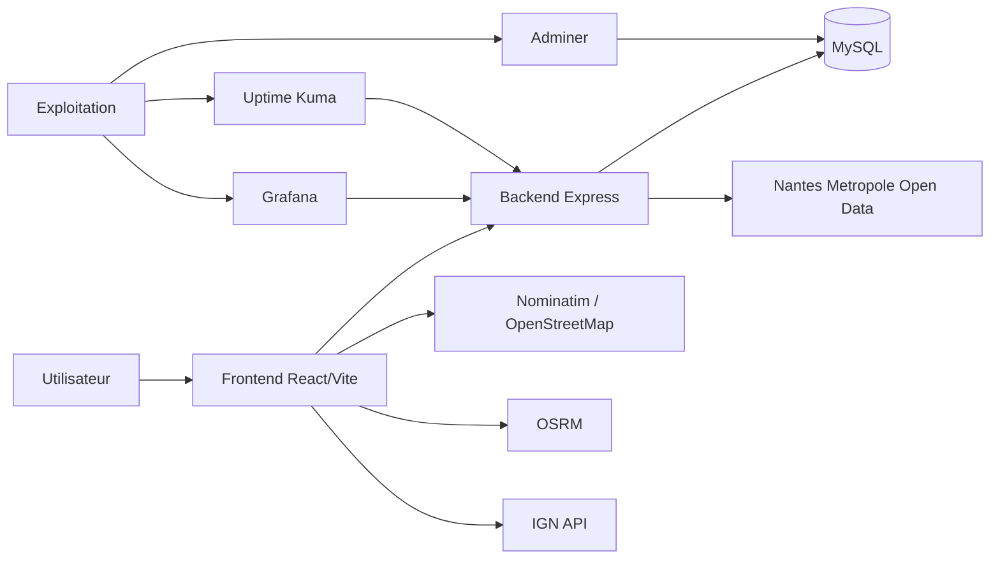

# Dapi

Dapi est une application web de cartographie PMR pour Nantes et sa metropole. Elle affiche les emplacements accessibles, propose une recherche d'adresses, calcule des itineraires et met en avant les points PMR proches du trajet.

## Architecture

L'application est decoupee en 4 blocs :

- **Frontend** : React + Vite + Leaflet, avec carte, recherche, filtres et outils d'accessibilite.
- **Backend** : Node.js / Express, expose l'API `/api/*`, synchronise les donnees et alimente MySQL.
- **Base de donnees** : MySQL, avec `communes`, `emplacements_pmr`, `utilisateurs`, `favoris`, `avis`.
- **Services externes** : Nantes Metropole, IGN, Nominatim, OSRM, OpenStreetMap, GHCR, Adminer, Uptime Kuma, Grafana.



### Flux

1. Le frontend charge les emplacements PMR via le backend.
2. Le backend lit MySQL et peut synchroniser les donnees depuis l'open data Nantes Metropole.
3. Le frontend geocode les adresses et calcule les itineraires via les services publics.
4. Les marqueurs personnalises sont stockes cote navigateur via `localStorage`.

## Structure du depot

| Chemin | Role |
|---|---|
| `src/` | Application frontend React |
| `backend/` | API, modele MySQL, scripts d'initialisation et de synchronisation |
| `tests/` | Tests Node.js |
| `compose.yml` | Stack de developpement / debug |
| `compose-prod.yml` | Stack de production a base d'images GHCR |
| `docs/` | ADR et runbooks |

## Lancer en local

### Prerequis

- Node.js 22+
- npm
- MySQL 8+

### 1. Recuperer le projet

```bash
git clone <url-du-repo>
cd Dapi
```

### 2. Installer les dependances frontend

```bash
npm install
```

### 3. Installer les dependances backend

```bash
cd backend
npm install
cd ..
```

### 4. Preparer les variables d'environnement

Copie `/.env.example` vers `/.env`, puis cree aussi `backend/.env` avec les memes valeurs cote backend.

Variables minimales :

```env
DB_HOST=localhost
DB_USER=dapi_user
DB_PASSWORD=mot_de_passe_fort
DB_NAME=dapi_pmr
DB_ROOT_PASSWORD=mot_de_passe_root
PORT=3001
FRONTEND_PORT=5173
VITE_API_BASE_URL=http://localhost:3001/api
API_BASE_URL=http://localhost:3001
```

### 5. Creer la base MySQL

Lancer MySQL localement, puis initialiser le schema :

```bash
cd backend
node scripts/initDB.js
cd ..
```

Le schema est defini dans `backend/database/schema.sql`.

### 6. Demarrer le backend

```bash
cd backend
npm run dev
```

Le backend ecoute par defaut sur `http://localhost:3001`.

### 7. Demarrer le frontend

Dans un autre terminal :

```bash
npm run dev
```

Le frontend Vite demarre par defaut sur `http://localhost:5173`.

### 8. Synchroniser les donnees PMR

Quand le backend est operationnel :

```bash
cd backend
node scripts/sync-once.js
```

## Procedure complete de lancement local

1. Installer Node.js 22+ et MySQL 8+.
2. Cloner le depot.
3. Installer les dependances du frontend a la racine.
4. Installer les dependances du backend dans `backend/`.
5. Creer `/.env` et `backend/.env`.
6. Initialiser le schema MySQL avec `node scripts/initDB.js`.
7. Demarrer le backend avec `npm run dev` depuis `backend/`.
8. Demarrer le frontend avec `npm run dev` depuis la racine.
9. Ouvrir l'application sur `http://localhost:5173`.
10. Lancer la synchronisation des donnees avec `node scripts/sync-once.js` si necessaire.

### Docker

- `compose.yml` est oriente developpement/debug.
- `compose-prod.yml` utilise les images publiees sur GHCR.
- Les reseaux `proxy-net` et `public_network` sont externes et doivent exister dans l'infra cible.

## API

| Methode | Route | Description |
|---|---|---|
| `GET` | `/api/emplacements` | Liste paginee des emplacements PMR |
| `GET` | `/api/emplacements/:id` | Detail d'un emplacement |
| `GET` | `/api/communes` | Liste des communes |
| `POST` | `/api/sync` | Synchronise les donnees Nantes Metropole vers MySQL |
| `GET` | `/` | Verification rapide du backend |

## Variables d'environnement

### Racine

| Variable | Role | Exemple |
|---|---|---|
| `FRONTEND_PORT` | Port Vite en local | `5173` |
| `VITE_API_BASE_URL` | URL du backend utilisee par le frontend | `http://localhost:3001/api` |
| `GITHUB_REPOSITORY_OWNER` | Prefixe des images Docker GHCR | `saachanmh` |

### Backend / MySQL

| Variable | Role | Exemple |
|---|---|---|
| `DB_HOST` | Hote MySQL | `localhost` ou `db` |
| `DB_USER` | Utilisateur MySQL | `dapi_user` |
| `DB_PASSWORD` | Mot de passe MySQL | `***` |
| `DB_NAME` | Base MySQL | `dapi_pmr` |
| `DB_ROOT_PASSWORD` | Mot de passe root MySQL | `***` |
| `PORT` | Port backend | `3001` |
| `API_BASE_URL` | URL utilisee par `backend/scripts/sync-once.js` | `http://localhost:3001` |

## Contribuer

### Conventions

- JavaScript ESM partout.
- ESLint comme reference de style.
- Variables inutilisees interdites.
- Fonctions courtes et nommage explicite.
- Commentaires seulement quand la logique n'est pas evidente.

### Verifications

```bash
npm run lint
npm test
npm run build
```

### Cote backend

```bash
cd backend
npm run dev
node scripts/initDB.js
node test-connection.js
```

### Messages de commit

Utiliser des commits courts et explicites :

- `feat: ...`
- `fix: ...`
- `docs: ...`
- `refactor: ...`
- `chore: ...`

## Ressources externes

- Nantes Metropole open data : https://data.nantesmetropole.fr/
- IGN geocodage : https://geoservices.ign.fr/documentation-services
- Nominatim : https://nominatim.org/
- OSRM : https://project-osrm.org/
- OpenStreetMap : https://www.openstreetmap.org/
- GHCR : https://ghcr.io/
- GitHub Packages containers : https://github.com/users/saachanmh/packages/container/package/dapi-frontend
- Adminer : https://www.adminer.org/
- Uptime Kuma : https://github.com/louislam/uptime-kuma
- Grafana : https://grafana.com/

## Documentation d'architecture

- ADR 0001 : `docs/adr/0001-configurable-api-base-url.md`
- Runbook : `docs/runbooks/sync-pmr-data.md`
